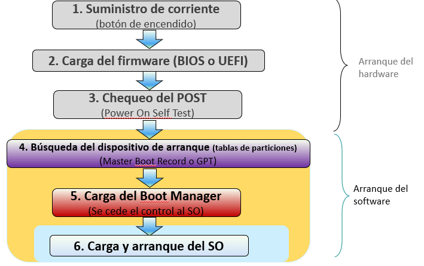
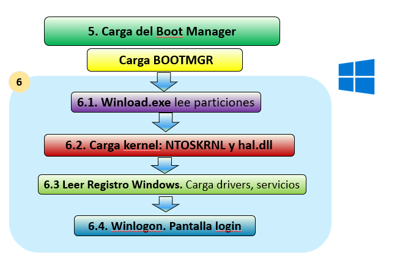
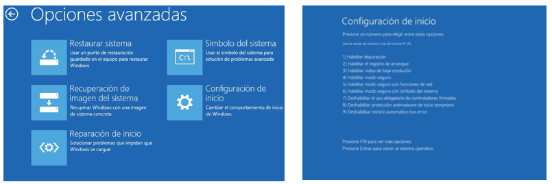

# UT5.2 Arranque de SO Windows

## Proceso de arranque de Windows

### BOOTMGR

**BOOTMGR** (Abreviatura de Boot Manager). Hasta Windows XP, el arranque del sistema se realizaba a través de un sistema denominado NTLDR. A partir de Windows Vista el archivo desapareció para ser reemplazado por Boot Configuration Data, (una BD cifrada usada por el nuevo Boot Manager de Microsoft).

Los archivos del Boot Manager, a diferencia de su antecesor, son guardados dentro de una carpeta oculta c:\boot del directorio raíz, y además, son cifrados de forma que no puedan ser editados manualmente desde un editor de texto. 

Para configurar las opciones de arranque, el usuario deberá contar con los privilegios del Administrador y hacerlo a través del comando bcdedit dentro del Símbolo del Sistema (CMD).

Proceso de arranque con BOOTMGR:

1. **Bootmgr** invoca al programa WinLoad.exe que carga la partición de arranque.
2. **WinLoad.exe** carga dos ficheros fundamentales para cargar el kernel de Windows: NTOSKRNL.EXE y hal.dll
3. Se leen los ficheros del **registro de Windows**, se cargan drivers y los servicios indicados.
4. Inicio de sesión: **WINLOGON** inicia la autoridad de seguridad local (LSASS.EXE), momento en el que aparecerá la pantalla de identificación de usuario.

## Menú de arranque avanzado

Presionando la tecla F8 justo antes del proceso de arranque de cualquier sistema Windows aparecerá un menú de opciones de arranque avanzadas de BOOTMGR (en caso de error o cierre inesperado puede aparecer automáticamente) con algunas diferencias en la interfaz y opciones entre distintas versiones de Windows.

### Opciones arranque avanzadas

- Reparar el equipo: Muestra una lista de herramientas de recuperación del sistema que puedes usar para reparar problemas de inicio, ejecutar diagnósticos o restaurar el sistema.
- Modo seguro: Inicia Windows con un conjunto mínimo de controladores y servicios.
- Modo seguro con funciones de red: Inicia Windows en modo seguro e incluye los controladores y servicios de red necesarios para tener acceso a Internet o a otros equipos de la red.
- Modo seguro con símbolo del sistema: Inicia Windows en modo seguro con una ventana de consola de símbolo del sistema en lugar de la interfaz de Windows habitual.  
- Habilitar el registro de arranque. Crea un archivo llamado ntbtlog.txt en el que se incluyen todos los controladores instalados durante el inicio y que puede resultar útil para solución de problemas.
- Habilitar vídeo de baja resolución (640×480). Inicia Windows con el controlador de vídeo actual y una configuración de resolución y frecuencia de actualización bajas. 
