# UT6.3 Operaciones generales en consola CMD

## La consola CMD

La consola de comandos, **CMD**, símbolo del sistema o también conocido como **Command prompt** es un intérprete de línea de comandos que lleva acompañando al sistema operativo de Microsoft durante décadas. Tanto es así que es el Shell original para el sistema operativo Microsoft DOS y el Shell predeterminado en Windows hasta la compilación *14791* de Windows 10, momento en el que **Windows Powershell** pasó a ser la opción predeterminada del sistema.

Con el símbolo del sistema podemos lanzar o ejecutar comandos básicos, preparar scripts relativamente sencillos y realizar muchas de las tareas que podemos hacer desde la interfaz gráfica del sistema operativo de Microsoft. Ahora bien, cuando necesitamos realizar desarrollos más avanzados, acceder a ciertas áreas del sistema o automatizar tareas es donde deberíamos usar Windows PowerShell.

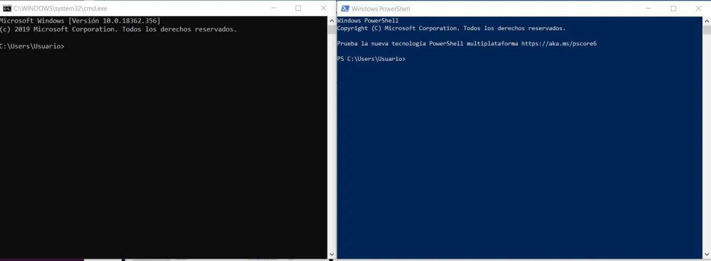

La **consola de comandos** (CMD) permite realizar tareas repetitivas de forma rápida. Escribimos el comando (y sus modificadores en su caso), presionamos **ENTER** y la aplicación CMD hará de intérprete para su ejecución.

Algunas **características** de la consola de Windows:

-   No diferencia entre mayúsculas y minúsculas.
-   Al escribir un nombre de archivo o carpeta con espacios conviene escribirlo siempre “*entrecomillado*”.
-   Los nombres pueden ser de hasta 255 caracteres.
-   Al eliminar un archivo este no va a la Papelera y se elimina.
-   Algunas operaciones requieren iniciar la consola como administradores (botón derecho\>**Ejecutar como administrador**)

Se puede configurar el **aspecto** así como ciertas propiedades de la consola de comandos haciendo clic en **propiedades.**

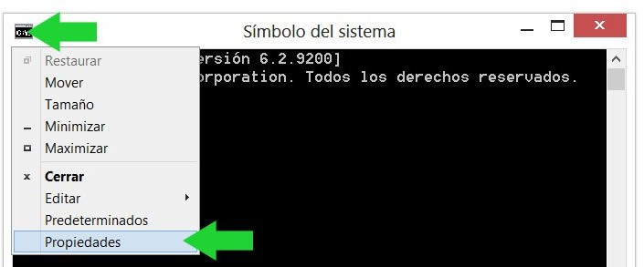

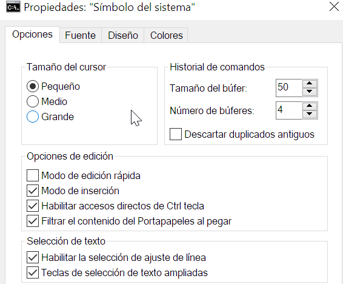

> 💡 La ruta en el disco actual indicada en la consola, y que indica estar a la espera de órdenes después del >, se denomina **PROMPT**.

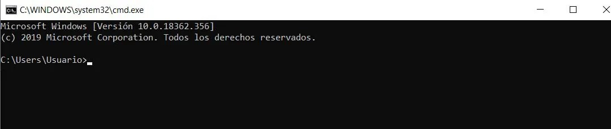


## Navegación por directorios

```tip
Para navegar o moverse de directorio en la consola de comandos se utiliza el comando **CD** (CHDIR) y el comando **CD..**
```

Navegar usando el Explorador de archivos como hemos visto es intuitivo y natural.

Generalmente cuando el usuario abre la consola, el directorio donde comienza es su **directorio personal**. Desde ahí uno puede moverse a los diferentes directorios donde se tenga acceso usando el comando.

El comando **CD..** navega al directorio padre (el anterior).

El comando **CD\\** navega al directorio raíz.  

## Creación de directorios

```tip
En el entorno de consola de comandos de Windows (CMD), para la creación de directorios se utiliza el comando **MD** (MKDIR). 
```

En el entorno gráfico, para crear una carpeta dentro de otra, tendremos que tener abierta aquella dentro de la cual queremos crear otra u otras carpetas. Esta carpeta principal, llamada carpeta padre, será de la que «cuelgue» la estructura de carpetas.

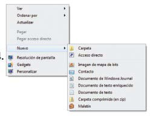
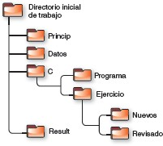

La sintaxis del comando **MD** es la siguiente: 

        MD nombre_directorio

## Consulta de directorios

```tip
En el entorno de consola de comandos de Windows, para la consulta del contenido de un directorio se utiliza el comando **DIR**. 
```

El **Explorador de Windows** a su vez permite mostrar la información de archivos y carpetas en iconos/listas personalizables.

Su sintaxis: 

        DIR [parámetros]

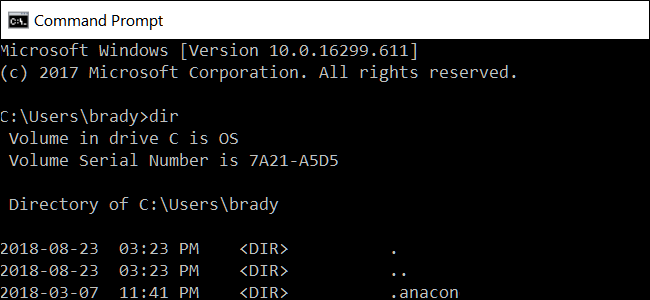

## Estructura de directorios

```tip
En el entorno de consola de comandos de Windows (CMD), utilizaremos el comando **TREE** para visualizar el árbol de directorios completo.
```


En la parte izquierda de la ventana del Explorador, se visualiza la estructura de directorios, unidades, así como accesos rápidos o bibliotecas.

Su sintaxis: 

        TREE [parámetros]

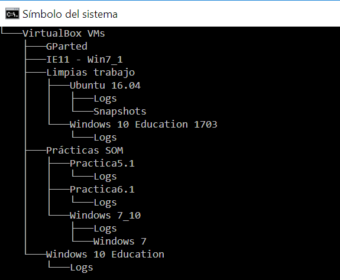

## Borrado archivos/directorios

```tip
El comando **RD** (RMDIR) se utiliza para borrar directorios ya vacíos.
```

```tip
El comando **DEL** (DELETE) se utiliza para borrar ficheros individualmente, o el contenido desde cierto directorio.
```

Al eliminar una carpeta o fichero desde la interfaz gráfica se mandará por defecto a la **papelera de reciclaje**. Si pulsamos a la vez la tecla *Mayús+Supr* se borrará el contenido seleccionado sin pasar por la papelera.

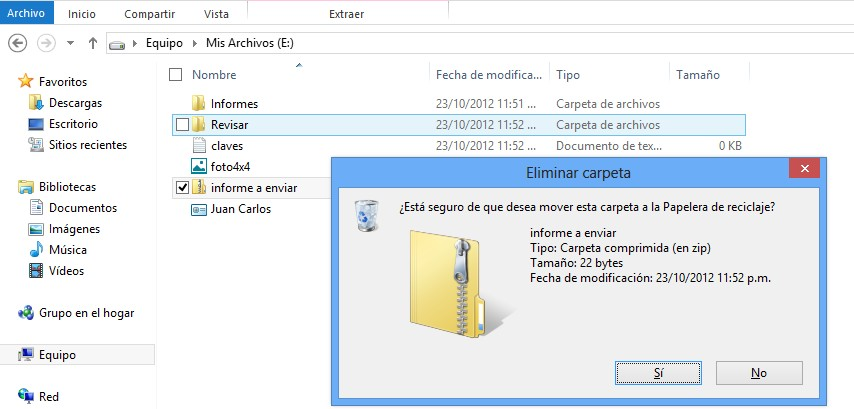

## Mover/copiar archivos/directorios

```tip
Para mover ficheros en la consola se utiliza el comando **MOVE**.
```

```tip
Para copiar ficheros en la consola se utilizan los comandos **COPY** y **XCOPY**.
```

La diferencia entre el comando **COPY** y el comando **XCOPY** radica en que uno, en el caso del comando COPY, no puede copiar subdirectorios y el **XCOPY** sí permite realizar **copia de archivos y subdirectorios** existente así como de **archivos ocultos** usando los parámetros apropiados. XCOPY además es más rápido.

La sintaxis de dichos comandos es la siguiente:

        COPY archivo_origen destino [parámetros] 
        XCOPY archivo_origen destino [parámetros]

Así por ejemplo:

    C:> COPY fichero.txt C:\Users\Javier\Desktop (ruta absoluta)
    C:> COPY fichero.txt Users\Javier\Desktop (ruta relativa)

**ROBOCOPY** es uno de los comandos disponibles más poderosos, útiles y empleados en la línea de comandos de Windows.

La aplicación Robocopy.exe, incluida en todas las versiones de Windows, permite copiar carpetas y directorios ya sea en un ordenador local o en la red. No copia archivos aislados. 


Ventajas de dicho comando:

-   Tolera las interrupciones en la copia de archivos, como por cortes de energía o red.
-   Realiza reintentos automáticos si no se puede acceder a un archivo.
-   Permite copiar grandes cantidades de archivos, imposible con XCOPY.
-   Muestra indicador de progreso.
-   Permite copiado multihilo.
-   Copia correctamente toda la información como propiedades, atributos, datos del propietario, fechas, etc además mantiene inalterables los permisos del archivo.

La sintaxis de dicho comando es la siguiente:

        ROBOCOPY origen destino [parámetros]

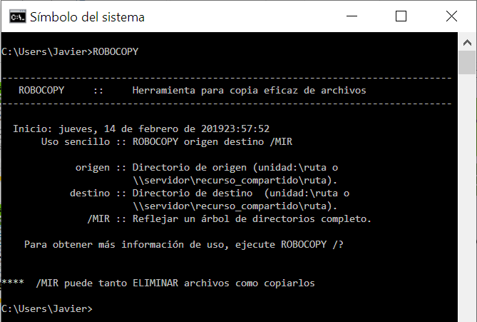

        C:> ROBOCOPY D:\PRUEBAHOY "\\sflimfs0\datalima\Sistemas y Tecnologia\PRUEBAHOY" /MIR /SEC /SECFIX


## Renombrar archivos/directorios

```tip
Para renombrar ficheros en la consola se utiliza el comando **REN**.
```

        C:> REN fichero.txt nuevonombre.doc

Para realizar esta operación en entorno gráfico, simplemente seleccionaremos la carpeta con el botón izquierdo del ratón y pulsaremos la tecla **F2**. De esta forma editamos el nombre de la carpeta para poder cambiarlo. Otra forma de hacerlo es haciendo un doble clic lento sobre el nombre de la carpeta/archivo o eligiendo la opción *Cambiar nombre* en el menú contextual de dicho elemento.

> A la hora de renombrar archivos hay que tener presente que si tenemos **accesos directos** que apuntan a un archivo y lo renombramos o movemos, el sistema realizará un cambio de ruta de forma automática, incluso si lo cambiamos de unidad.

## Comandos útiles consola CMD

```tip
Para mostrar un texto en consola se usa el comando **ECHO**
```

        C:> ECHO HOLA

💡 Si escribimos **ECHO.** simplemente aparecerá una línea en blanco de separación, muy útil para separar contenido.

```tip
Para visualizar el contenido de un fichero de texto se utiliza el comando **TYPE**
```

        C:> TYPE fichero_texto.txt


Para crear un **fichero de texto vacío**, se puede hacer de varias formas:

        C:> COPY CON fichero.txt

        C:> ECHO. > fichero.txt


Otra forma sería abriendo el *bloc de notas* de Windows con un fichero como parámetro y a continuación guardarlo desde la interfaz.

        C:> notepad fichero.txt

```tip
Para mostrar o cambiar la hora se utiliza **TIME** y para la fecha **DATE**.
```

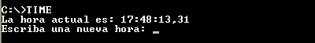

```tip
Para mostrar la versión del Sistema Operativo en la consola se utiliza VER.
```

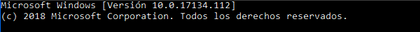

```
Para reiniciar o apagar nuestro equipo se usa el comando **SHUTDOWN**
```

El comando SHUTDOWN utiliza la siguiente sintaxis:

    SHUTDOWN [-s\|-r] -t Tiempo -c "Comentario"

    \-s indica que apagaremos el equipo
    \-r indica que queremos reiniciarlo
    \-t debe ir seguido de los segundos que demore en apagar.

```tip
Para borrar el contenido de la pantalla de la consola se usa el comando **CLS**
```

```tip
Para mostrar una ventana de la interfaz de Windows con un mensaje utilizaremos el comando **MSG**.
```

Se deberá especificar destinario del mensaje y texto del mensaje:

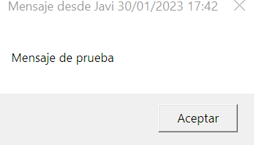

```tip
Para programar acciones básicas desde la consola se puede llevar a cabo utilizando el comando **AT**.
```

Junto con el parámetro */interactive* a las 20:00 nos aparecerá un mensaje que nos dirá que son las 8 de la Noche.

        AT 20:00 /interactive MSG * Son Las 8 de la noche


💡 El comando AT está en desuso, pero nos puede seguir siendo útil para cosas sencillas.

## Comodines consola CMD

En la consola existen **comodines** universales que permiten especificar grupos de:

-   archivos.
-   directorios (carpetas)
-   archivos y directorios.

cuyos nombres tengan uno o más caracteres en común.

| **Comodín** | **Descripción uso**                                 |
|-------------|-----------------------------------------------------|
| **\***      | Representa a cero, uno o más caracteres cualquiera. |
| **?**       | Representa a un sólo carácter cualquiera.           |

Sintaxis de ejemplo:

        DIR a\*
        MOVE progr?m?.exe programas 
        DIR archivo?.txt

-   Mostrar todos los archivos y cuyos nombres comienzan por **a**:

        C:> DIR a*

-   **Mover** todos los archivos que tengan extensión **.exe** al directorio PROGRAMAS:

        C:> MOVE *.exe PROGRAMAS 

-   **Mostrar** todos los archivos que comienzan por **a** y terminan por **a** con la extensión **.txt**:

        C:> DIR a*a.txt 


-   **Copiar** las imágenes **jpg** a un directorio BACKUP en la **unidad D**:

        C:> COPY *.jpg D:\BACKUP

-   **Copiar** todos los archivos y subdirectorios al directorio BACKUP:

        C:> XCOPY *.* D:\BACKUP /S

## Atributos del sistema

```tip
En el entorno de consola de comandos de Windows (CMD), para visualizar los atributos de archivos se utiliza el comando **ATTRIB**. 
```


| **Letra** | **Atributo** | **Traducción** | **Descripción**                                                                        |
|-----------|--------------|----------------|----------------------------------------------------------------------------------------|
| A         | De archivo   | *Archive*      | Se asigna por defecto, tipo de archivo común.                                          |
| R         | Sólo lectura | *Read Only*    | Un directorio o archivo con este atributo sólo se podrá leer, ni modificar, ni borrar. |
| H         | Oculto       | *Hidden*       | Archivo o directorio oculto.                                                           |
| S         | De sistema   | *System*       | Archivo especial del sistema operativo; oculto y de sólo lectura.                      |
| I         | Indexado     | *Index*        | Archivo indexado especial.                                                             |

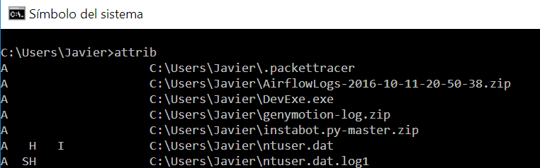 

Los archivos tienen varios **atributos**, usados habitualmente como hemos visto y usan el comando **ATTRIB**.

Sintaxis del comando:

-   Para añadir un atributo se usa **+**
-   Para quitar un atributo se usa **─**

        ATTRIB +- atributo archivo [/S] [/D]
        ATTRIB /S (Procesa archivos que coinciden en la carpeta actual y todas las carpetas)
        ATTRIB /D (Procesa solo carpetas)

Por ejemplo:

        ATTRIB +A fichero.txt
        ATTRIB +H *
        ATTRIB +SH *.jpg


## Redireccionamiento

Antes de continuar con las tareas de **administración** de Windows, vamos a ver herramientas útiles y conceptos de la consola como el **redireccionamiento**.

-   Todos los programas que procesan datos de entrada tienen un dispositivo de **entrada**.

-   Similarmente todos los programas que visualizan datos tienen un dispositivo de **salida**.

Por defecto el dispositivo de entrada es el **teclado** y el dispositivo de salida el monitor o **pantalla**.

Para poder redireccionar la entrada y la salida en la consola CMD utilizaremos los siguientes símbolos después del correspondiente comando:

        <  Redirección de la entrada
        >  Redirección de la salida
        >> Redirección de la salida y adición a un fichero.


## Redireccionamiento de salida

Por ejemplo para redirigir la **salida** del comando DATE podríamos crear un fichero de texto que se llamara *FECHA.TXT* y cuyo contenido es una única línea usando **\>**

> 💡 Si el fichero ya existiera se **sobrescribiría** su contenido.

        C:> DATE > FECHA.TXT


Si quisiéramos **añadir contenido** a ese mismo fichero existente sin sobreescribir nueva información, como por ejemplo con la hora usaríamos **\>\>**

        C:> TIME >> FECHA.TXT

El redireccionamiento es útil para guardar la información devuelta por los comandos que usemos, o en un fichero de procesamiento por lotes y que podría guardarse en un fichero de registro o **log**.

        C:> DIR >> REGISTRO.LOG


## Redireccionamiento de entrada

El otro tipo de direccionamiento es el de **entrada**. Por ejemplo, para redirigir la entrada del comando DATE podríamos crear un fichero de texto que se llamara *FECHA.TXT* y cuyo contenido es una única línea:

        01/02/2022

A continuación ejecutamos el comando DATE redirigiendo su entrada de la siguiente forma usando **\<**

        C:> DATE < FECHA.TXT

El comando leería el contenido del fichero de texto y modificará la hora del sistema sin pedirla por teclado.

## Búsqueda de textos

```tip
Para buscar una cadena de caracteres dentro de un fichero se utiliza el comando **FIND**.
```

Este comando recibe como entrada datos dispuestos en filas y devuelve aquellas filas que contienen la cadena de caracteres que se ha especificado en la orden.

Su sintaxis:

FIND [parámetros] "cadena" fichero

Donde parámetros puede ser:

    /V: Muestra todas las líneas que no contienen la cadena.
    /C: Muestra sólo el número de ocurrencias que contienen la cadena.
    /I: No distingue mayúsculas y minúsculas.
    /N: Muestra las líneas de texto con la cadena y los números de esas líneas

```warning
Cuidado porque este comando es sensible a mayúsculas y minúsculas, con lo que no será lo mismo “*cadena*” que “*CADENA*”.
```

Ejemplos:

    FIND "azul" C:\Users\Javier\colores.txt

    FIND "javier" *.txt

    FIND "a*r" listado.txt

    FIND "javier" fichero.txt /V

> 💡 Recuerda que para salir de cualquier fichero bat en ejecución debes de presionar *Ctrl+C*

Una mejora de este comando es el comando *FINDSTR* que es muy parecido, pero sin mostrar cabeceras en el resultado de las búsquedas.

## Contar elementos

Contar elementos es una tarea común en la consola CMD. 

```tip
Para contar elementos se usa el comando *FIND*
```

        FIND /C /V ""

Por ejemplo, si queremos contar las líneas de un fichero podemos utilizar *TYPE* y *FIND* para contarlas de la siguiente forma:

        TYPE fichero.txt | FIND /C /V ""

## Comparar ficheros

```tip
Para comparar el contenido de dos ficheros de texto y mostrar las diferencias entre ellos se utiliza el comando **FC**
```

        C:> FC fichero1.txt fichero2.txt


- Fichero *colores1.txt*

        Rojo
        Verde
        Azul
        Amarillo
        Blanco
        Negro

- Fichero *colores2.txt*

        Rojo
        Cian
        Verde
        Azul
        Naranja
        Blanco
        Magenta


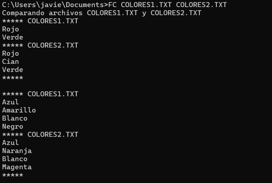

----

| **Operaciones (Acciones)**                     | **Comando CMD**  |
|------------------------------------------------|------------------|
| Borrar pantalla consola                        | CLS              |
| Fecha y hora                                   | DATE/TIME        |
| Ayuda comandos                                 | HELP o /?        |
| Salir de la consola                            | EXIT             |
| Ver el contenido de un directorio              | DIR              |
| Crear directorios                              | MD o MKDIR       |
| Cambiar de directorio                          | CD o CHDIR       |
| Ver el árbol de directorios                    | TREE             |
| Copiar archivos                                | COPY             |
| Copiar archivos y subdirectorios               | XCOPY o ROBOCOPY |
| Cambiar el nombre de archivos y directorios    | REN o RENAME     |
| Mover archivos y directorios                   | MOVE             |
| Eliminar archivos                              | DEL o ERASE      |
| Eliminar directorios                           | RD o RMDIR       |
| Visualizar/modificar atributos                 | ATTRIB           |
| Comparar contenido ficheros                    | FC               |
| Visualizar el contenido de un fichero de texto | TYPE             |
| Búsqueda de textos (o contar)                  | FIND o FINDSTR   |
| Apagar o reiniciar el equipo                   | SHUTDOWN         |
| Lanzar una ventana con un mensaje              | MSG              |
| Redireccionamiento                             | \> , \>\>, \<    |


## Filtro MORE

```tip
Los filtros o tuberías son utilizados también a menudo **después** de un comando usando para ello el símbolo de tubería |
```

El filtro **MORE** recibe como entrada un listado o archivo de texto organizado en filas y devuelve como salida ese mismo texto introduciendo cada 23 filas una línea con los caracteres “-- Más --

Es decir, cuando el dispositivo de salida es el monitor, el filtro MORE pagina un archivo de texto de forma que pueden verse 23 líneas en cada pantalla o el largo de la ventana. Un ejemplo:

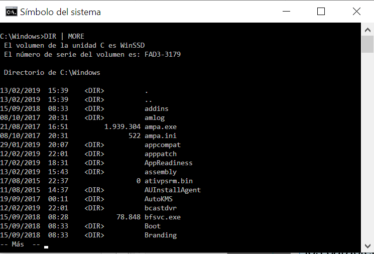

## Filtro SORT

```tip
El filtro **SORT** recibe, igual que MORE, un conjunto de datos organizados en filas y los ordena.
```

**SORT** devuelve los datos ordenados según el primer carácter de cada fila. La ordenación se realiza en base al código ASCII. La ordenación es literal. El espacio en blanco es anterior a los números, y éstos a cualquier letra. 

```warning
SORT no distingue entre mayúsculas y minúsculas ni entre letras acentuadas y letras sin acentuar.
```

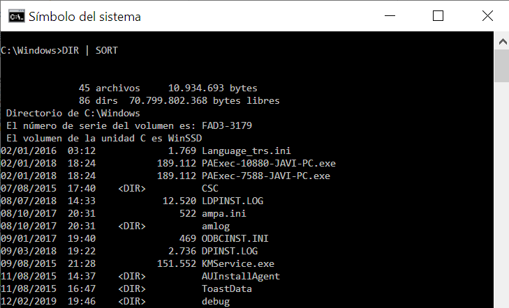Ejemplos:

## Comando SORT

También se puede utilizar **SORT** como comando independiente.

💡 SORT tiene un parámetro para ordenar columnas respecto a un fichero de texto, indicando en este caso la posición de la columna por la que queramos ordenar usando para ello el parámetro **/+n**

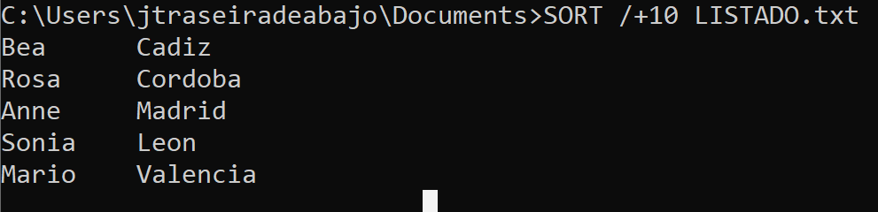
