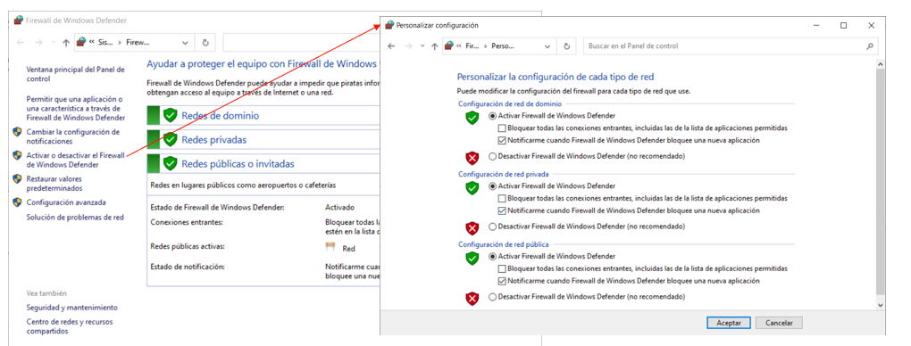
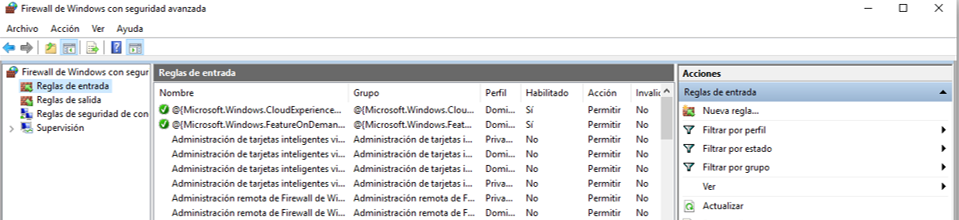
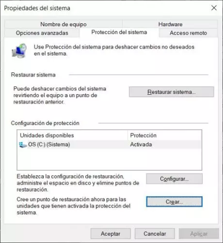
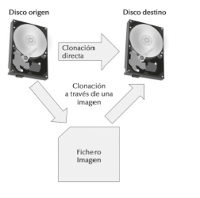
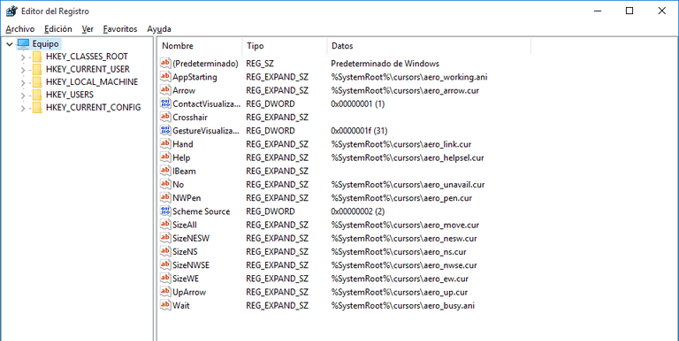

# UT8.2 Administración de Windows: Seguridad y ficheros por lotes

## Seguridad de Windows

Dentro del apartado seguridad en configuración de Windows encuentran juntos todos los apartados de seguridad relativos al equipo (Windows Defender):

- Protección antivirus y amenazas
- Protección de cuentas
- Control de aplicaciones y navegador
- Protección de Firewall
- Seguridad del dispositivo


### Protección contra virus y amenazas

Protección contra virus y amenazas, de Seguridad de Windows sirve para detectar y analizar el dispositivo en busca de amenazas. Se pueden realizar diferentes tipos de análisis, ver los resultados de los análisis anteriores de virus y amenazas y obtener la última protección ofrecida por el Antivirus de **Windows Defender**.

### Firewall de Windows

```note
Un firewall, o cortafuegos, es un programa informático (o hardware) que brinda protección a ordenador o dispositivo en una red frente a intrusos y accesos no autorizados.
```

Un firewall monitorea el tráfico de una red, ya sea entrante o saliente y decide si permite o bloquea dicho tráfico en función de un conjunto definido de reglas de seguridad.


El Firewall de Windows se puede desactivar, aunque no está recomendado, entrando en Firewall de Windows Defender y luego accediendo a *Activar o desactivar el Firewall de Windows Defender*. 



Pulsando en el apartado configuración avanzada podremos entrar a configurar en profundidad el firewall de Windows 10/11 y sus reglas que veremos a continuación:

- **Reglas de entrada**: Controlan el tráfico que se permite o bloquea desde fuentes externas, es decir, las conexiones que se generan en Internet y que llegan a nuestro equipo.
- **Reglas de salida**: Controla las conexiones que se generan en nuestro ordenador y que tengan como objetivo salir a Internet.

El Firewall de Windows 10/11 nos va a permitir crear hasta cuatro tipos de reglas diferentes:

- **Programa**: Regla que controla las conexiones de un programa en concreto
- **Puerto**: regla que controla conexiones de un puerto TCP o UDP
- **Predefinida**: podremos seleccionar reglas predefinidas de Windows para sus servicios.
- **Personalizada**: regla que podremos configurar en detalle con todos los parámetros.



- Seleccionamos en el panel izquierdo el tipo de regla que queremos crear y en la derecha, pulsaremos sobre Nueva regla y rellenaremos los siguientes pasos que veremos; Tipo de regla, Programa, Acción, perfil y Nombre.

- Si en vez de un programa hemos seleccionado un puerto se abrirá un paso adicional donde seleccionar el tipo de protocolo y puerto a configurar en la nueva regla.

- El asistente también puede dar a elegir el ámbito de direcciones, ya sean IP locales o remotas para las que se hará efectiva dicha regla.  

- En el penúltimo paso de **perfil** se debe configurar cuándo queremos que se aplique la regla, dentro de un dominio, en una red pública o en una red privada.

## Respaldo del sistema

### Restaurar sistema

Windows lleva a cabo, de forma automática y periódica, y en momentos puntuales en que se llevan a cabo ciertas modificaciones de software, lo que se denominan **puntos de restauración**. 

En estos puntos se guarda la información clave sobre la situación del sistema, antes de que se produzcan cambios en el software de diversos tipos, como por ejemplo a nivel de drivers. Así, si con posterioridad tenemos problemas de rendimiento, funcionamiento o compatibilidad, podemos volver atrás a la situación exacta en que, en la fecha de ese punto de restauración, estaba el ordenador en términos de software. No afecta a los documentos nuevos que hayamos guardado, ni programas que hayamos instalado posteriormente (aunque sí su configuración guardada en Windows)

Por defecto Restaurar sistema no siempre está activado, con lo que deberemos de acceder al apartado de propiedades del sistema y Protección del sistema.
Para forzar a crear un nuevo punto de restauración lo haremos desde el botón Crear.



### Clonación 

Hacer una imagen del sistema consiste en clonar sus discos o particiones. Un disco está formado por particiones e información de arranque. Esta información de arranque es importante si hay instalado un sistema operativo en dicho disco.

Las herramientas de clonación pueden tanto clonar discos como clonar particiones. La diferencia entre ambas resulta obvia. Al clonar dos discos, ambos discos serán iguales; pero si se clonan todas las particiones de un disco a otro, puede ser que no se clone el cargador que contenga el disco de origen.



Para hacer una imagen del sistema desde Windows 10/11, hay que acceder a la herramienta heredada de copias de seguridad desde el antiguo panel de control y acceder a **crear imagen de sistema**.

### Copias de seguridad

Las copias de seguridad, **backup** o copias de respaldo consisten en duplicar todo o parte de un sistema para poder afrontar un fallo en el mismo, un borrado accidental, una corrupción de datos, etc.

La restauración de la copia de seguridad recuperará la información disponible en la fecha de la realización de dicha copia. Por lo tanto, si en una empresa se realizan copias de seguridad todos los domingos y el viernes por la tarde se avería el disco del servidor, el resultado es la pérdida de todos los datos de la semana.
Generalmente, las copias de seguridad son completas o totales. Eso quiere decir que en un backup se incluye toda la información seleccionada.

Windows posee dos herramientas de copia de seguridad (una de ellas heredada).

Para acceder a ella desde el *panel de configuración*:


Una vez dentro podemos crear una copia de seguridad con historial de archivos o utilizar la herramienta de copia de seguridad heredada de Windows 7.

Las nuevas versiones de Windows, como Windows 11, permiten hacer copias de seguridad de la configuración del usuario en la nube, para que si cambiamos de equipo todas las configuraciones sigan igual, pero no es una copia de seguridad al uso clásico.


## Ficheros por lotes bat

```note
Un fichero por lotes es un archivo de texto sin formato que contiene uno o más comandos y tiene una extensión de nombre de archivo .bat.
```

Los *ficheros por lotes*, que también se denominan programas por lotes o scripts, se utilizan para simplificar las tareas rutinarias o repetitivas de Sistemas Operativos Windows. Se pueden crear scripts para otros SO como Linux pero utilizando su propia sintaxis y reglas, que veremos más adelante.

Cualquier editor de texto puede editar ficheros por lotes. Se puede usar el bloc de notas. Si queremos que el **código se resalte** se recomienda crear y editar los ficheros por lotes mediante el editor el **Notepad++**.

Cuando se escribe el nombre del fichero en el símbolo del sistema, cmd.exe ejecutará los comandos de forma secuencial a medida que aparecen en el archivo.

Un archivo *bat* contiene una o varias líneas de comandos en Windows, que se ejecutan secuencialmente (una a una) tal y como ya hemos visto.

-   La primera de ellas suele ser: @ECHO OFF
> Es usada para mostrar en la ventana de la consola mientras se ejecuta el fichero batch, solo la información necesaria.
-   A continuación se agregarán los comandos necesarios.
-   Finalmente se puede usar el comando PAUSE, para evitar que se cierre la ventana, de utilidad en muchas situaciones. En ese caso será necesario presionar cualquier tecla para cerrarla.

    Un ejemplo sencillo llamado prueba.bat:

```bat
@ECHO OFF
ECHO Cuando pulses cualquier tecla se borrará el contenido de la consola
PAUSE
CLS
EXIT
```

Por ejemplo, supongamos que queremos guardar todo el contenido de nuestra carpeta de **Mis Documentos** en una carpeta del **disco duro externo** que nos acabamos de comprar. Repetiremos dicha operación cada cierto tiempo.

Lo primero de todo sería crear un fichero de procesamiento por lotes dentro del directorio o carpeta de usuario de documentos de nuestro usuario (C:\\users\\usuario\\documents). Lo llamaremos por ejemplo *copiaseg.bat* y desde el bloc de notas introduciremos los comandos:

```bat
@ECHO OFF
ECHO Presione cualquier tecla para comenzar
PAUSE
ECHO Procediendo a la copia de seguridad…
XCOPY *.* D:\COPIASEGURIDAD\ /Y
```

> A continuación, podríamos crear una tarea en el editor de tareas referido a dicho fichero.

### Comandos útiles consola CMD

```tip
Para pausar el contenido hasta presionar una tecla se utiliza **PAUSE**
```

```tip
Si queremos pausar la ejecución durante unos segundos concretos usaremos **TIMEOUT** indicando a continuación los segundos.
```

### Uso de variables con SET

Ya hemos visto en anteriores la existencia de las **variables de entorno del sistema** operativo, pero su utilización en ficheros de procesamiento por lotes puede ser necesaria por diversas razones.

- Para asignar el valor de una variable usábamos **SET variable=valor**
- Para mostrar el valor de una variables en un fichero .bat se escribía entre los símbolos % de la siguiente forma: **%variable%**

```bat
 @ECHO OFF
SET NOMBRE=BULBASUR
SET NIVEL=25
SET COLORDEPELO=AZUL
ECHO HOLA ME LLAMO %NOMBRE%
ECHO SOY DE NIVEL %NIVEL%
ECHO MI COLOR DE PELO ES %COLORDEPELO%
```

Mediante archivos bat también podemos realizar operaciones aritméticas como multiplicar, sumar, dividir, etc. usando el modificador **SET /A**, por ejemplo de la siguiente forma hacemos la operación: 2 + 43 = 45.

```bat
@ECHO OFF
SET numero1=2
SET numero2=43
SET /A suma=%numero1% + %numero2%
ECHO La suma total es %suma%
PAUSE
EXIT
```

Los operadores **aritméticos** matemáticos que podemos utilizar con SET /A son los siguientes:

| **Operador** | **Significado**          |
|--------------|--------------------------|
| **()**       | Agrupación en parántesis |
| **+**        | Suma                     |
| **-**        | Resta                    |
| **\***       | Multiplicación           |
| **/**        | División                 |
| **%%**       | Resto                    |

También podemos requerir al usuario leer una variable por teclado usando el comando **SET** con el parámetro **/P** de la siguiente forma:

        SET /P nombrevariable=[texto_usuario ]


```bat
@ECHO OFF
SET /P nombre=Por favor, introduzca su nombre:
SET /P apellidos=Introduzca sus apellidos:
ECHO Buenos dias %nombre% %apellidos%
```

Podemos usar las variables del sistema que ya conocemos en nuestros ficheros.

| **Variable**   | **Definición**                                                                                                        |
|----------------|-----------------------------------------------------------------------------------------------------------------------|
| %HOMEPATH%     | Directorio por defecto del usuario actualmente logueado.                                                              |
| %APPDATA%      | Directorio oculto donde guardan sus datos las aplicaciones, dentro de la carpeta de usuario.                          |
| %COMPUTERNAME% | Devuelve el nombre del equipo.                                                                                        |
| %ERRORLEVEL%   | Devuelve el código de error del último comando ejecutado.                                                             |
| %HOMEDRIVE%    | Devuelve la unidad en la que está el directorio en el que estás actualmente.                                          |
| %LOCALAPPDATA% | Directorio donde los programas guardan archivos temporales. Generalmente C:\\Users\\NombreDeUsuario\\AppData\\Local.  |
| %PROGRAMDATA%  | Directorio donde los programas almacenan datos, normalmente: C:\\ProgramData.                                         |
| %PROGRAMFILES% | Devuelve la carpeta donde se instalan los programas, normalmente: C:\\Archivos de Programa.                           |
| %RANDOM%       | Devuelve un número al azar entre 0 y 32767.                                                                           |
| %SYSTEMDRIVE%  | Devuelve la unidad que contiene el directorio raíz del sistema, generalmente: C.                                      |
| %SYSTEMROOT%   | Devuelve la carpeta de administración, que suele ser C:\\Windows.                                                     |
| %TEMP% %TMP%   | Estas dos variables contienen la ruta a los directorios donde los programas pueden almacenar sus archivos temporales. |
| %TIME%         | Devuelve la hora actual.                                                                                              |
| %USERNAME%     | Devuelve el nombre del usuario actual.                                                                                |
| %USERPROFILE%  | Devuelve la ruta del directorio donde están los archivos del usuario actual, normalmente: C:\\Users\\NombreDeUsuario. |
| %WINDIR%       | Devuelve la ruta de la carpeta del sistema operativo, normalmente: C:\\Windows.                                       |


### Etiquetas en ficheros bat
 
La lectura de los ficheros de procesamiento por lotes o Batch es lineal, pero existe una forma para que el Batch se salte líneas, o vuelva a alguna anterior.

Esto se logra con **Etiquetas** y la función **GOTO**.

Las etiquetas también nos sirven para delimitar el código de un fichero. Para crear una etiqueta solo debemos escribir: 

        :NombreEtiqueta

De esta manera el **GOTO** funciona escribiendo GOTO seguido del nombre de la etiqueta, como vemos en el siguiente ejemplo.

```bat
@ECHO OFF
GOTO :MIETIQUETA
ECHO ¿Por qué me saltan?
:MIETIQUETA
ECHO Hola, esta es la etiqueta y hemos saltado una línea antes
PAUSE
EXIT
```

### Condicional

💡 El **condicional** es un elemento muy útil a la hora de generar archivos de procesamiento por lotes. Se usa **IF** y se puede utilizar para comparar, cadenas, números o para saber si existen archivos.

Ejemplo de sintaxis: 

        IF %cadena1% == %cadena2% OrdenAEjecutar

Que se podría leer de la siguiente manera. Si cadena1 es igual a Cadena2 ejecutaremos la Orden *OrdenAEjecutar*.

También podríamos usar el **IF NOT** para verificar si no son iguales.

        IF NOT %cadena1% == %cadena2% ejecutarAccion

Para saber si un archivo existe, se usa **IF EXIST**:

        IF EXIST "NombreDelArchivo" AccionAEjecutar

O también para ver si NO existe:

        IF NOT EXIST "NombreDelArchivo" AccionAEjecutar

Las **comparaciones** válidas con el comando IF admiten los siguientes operadores:

| **Operador** | **Descripción uso**                                 | **Ejemplos**       |
|--------------|-----------------------------------------------------|--------------------|
| **==**       | Si dos números o variables son iguales              | IF %v1% == %v2%    |
| **GTR**      | Si el primer número es mayor que el segundo         | IF 1 GTR 2         |
| **LSS**      | Si el primer número es menor que el segundo         | IF %opera% LSS 2   |
| **GEQ**      | Si el primer número es mayor o igual que el segundo | IF %op1% GEQ %op2% |
| **LEQ**      | Si el primer número es menor o igual que el segundo | IF 12 LEQ 32       |

Cuando se ejecuta cada una de las sentencias devolverá el valor 0 (correcto) en una variable llamada **ERRORLEVEL**.

Si alguna sentencia tiene algún error o es falsa devolverá un valor distinto de 0.

**ERRORLEVEL** se utiliza también los condicionales:

- IF ERRORLEVEL 0 Si no ha ocurrido ningún error o la sentencia es verdadera.

- IF NOT ERRORLEVEL 0 Si ha ocurrido algún error o la sentencia es falsa.

Ejemplo de un fichero bat que verifica si existen dos **directorios** y si fuera el caso lo borrará con RD. Si algo falla mostrará un error.

```bat
@ECHO OFF
IF EXIST MODELO73 RD MODELO73 /S /Q
IF EXIST PRACTICA73 RD PRACTICA73 /S /Q
MD C:\USERS\LOGON
IF ERRORLEVEL 1 GOTO ERROR
ECHO Todo correcto
GOTO FIN
:ERROR
ECHO Se ha producido un error
:FIN
ECHO Fin del programa
```

Ejemplo de un fichero bat que verifica si existe un **fichero** y si no mostrará un mensaje de error y saldrá:

```bat
@ECHO OFF
IF NOT EXIST %1% (
ECHO No se encuentra el fichero %1%
GOTO FIN
)
:FIN
```

Resumen del comando **IF**:

| **Condición** | **Operador**   | **Descripción uso**                                           | **Ejemplos**        |
|---------------|----------------|---------------------------------------------------------------|---------------------|
| **IF**        | **NOT**        | Negación de la condición que venga a continuación             | IF NOT %v1% == %v2% |
| **IF**        | **EXIST**      | Si el primer número es mayor que el segundo                   | IF EXIST fichero    |
| **IF**        | **==**         | Si dos números o variables son iguales                        | IF %v1% == %v2%     |
|               | **GTR**        | Si el primer número es mayor que el segundo                   | IF 1 GTR 2          |
|               | **LSS**        | Si el primer número es menor que el segundo                   | IF %opera% LSS 2    |
| **IF**        | **ERRORLEVEL** | Sirve para verificar si el comando anterior ha dado un error. | IF ERRORLEVEL 0     |


Recordar que se pueden lanzar ventanas de la interfaz de Windows desde ficheros bat con mensajes utilizando el comando **MSG** utilizando la siguiente sintaxis:

    MSG {username } [/TIME:seconds] [/V] [/W] [mensaje]


### Paso de parámetros

💡 Se puede pasar **parámetros** a los ficheros bat a la hora de llamarlos en la consola. Los valores pasados como parámetros se almacenan en las variables **%1**, para hacer referencia al primer parámetro posicional, **%2** hará referencia al segundo, y así sucesivamente.

```bat
@ECHO OFF
ECHO Hola
ECHO El primer parámetro es %1%
ECHO El primer parámetro es %2%
ECHO El primer parámetro es %3%
```

| **Operaciones (Acciones)**                | **Comando y parámetros**                                                   | **Ejemplo uso**               |
|-------------------------------------------|----------------------------------------------------------------------------|-------------------------------|
| Dar valor directamente a una variable     | SET vble=valor                                                             | SET nombre=javier             |
| Operaciones aritméticas                   | SET /A                                                                     | SET /A suma=%a%+%b%           |
| Pedir al usuario el valor de una variable | SET /P vble=texto                                                          | SET /P dni=Introduzca su DNI: |
| Parámetros pasados al fichero por lotes   | %1, %2, %3                                                                 |                               |
| Saltar en un programa por lotes           | GOTO                                                                       | GOTO Etiqueta                 |
|  Condicionales                            | IF [NOT] vble comparador\* acción \*el comparador puede ser ==, GTR, LSS.. |  IF %valor% == 2 GOTO Fin     |
| Ventana mensaje                           | MSG                                                                        | MSG \* mensaje                |


## Menús sencillos

```bat
@ECHO OFF
:MENU
echo.
echo 1. Opcion1
echo 2. Opcion2
echo.
SET/P opcion= Elija una opcion: 
IF %opcion%==1 goto ETIQUETA1
IF %opcion%==2 goto ETIQUETA2
IF %opcion% GTR 2 echo La opcion no existe
GOTO MENU
:ETIQUETA1
 ...
GOTO MENU
:ETIQUETA2
 ...
GOTO MENU
```

## El registro de Windows

```note
El registro de Windows es una base de datos jerárquica donde se guarda toda la información sobre configuraciones y ajustes de Windows. También almacena y centraliza datos sobre programas, licencias, dispositivos, usuarios y hardware.
```

Para ver contenido del registro de Windows, o editar información contenido en este se utiliza el programa *REGEDIT*.



A la izquierda de la ventana principal hay una serie de carpetas llamadas claves del registro. Dentro de ellas hay subcarpetas o subclaves. Al entrar en ellas se muestran los valores del registro a la derecha; constan en general de un nombre, un tipo y un dato o valor. 
