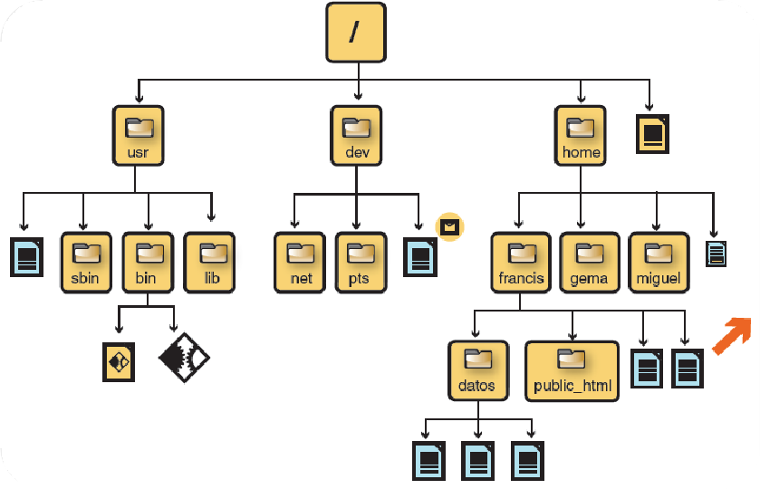
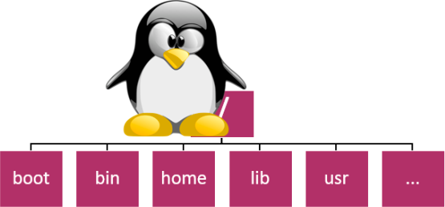
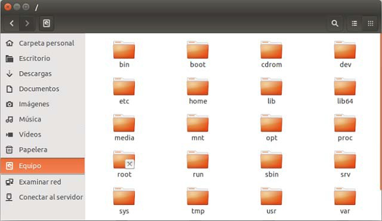
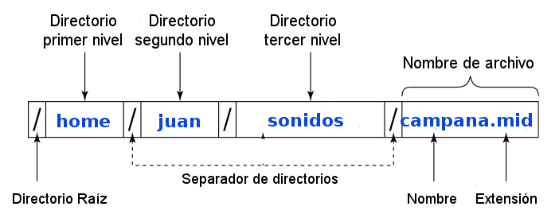
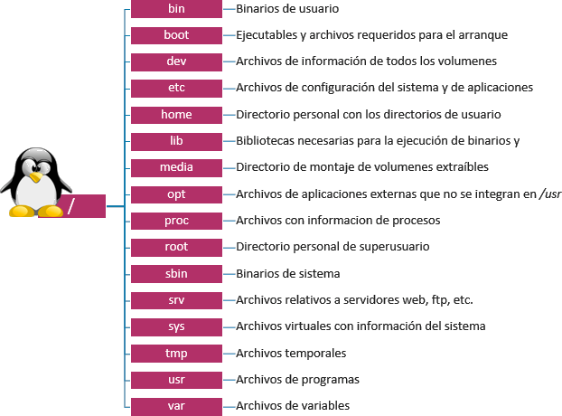
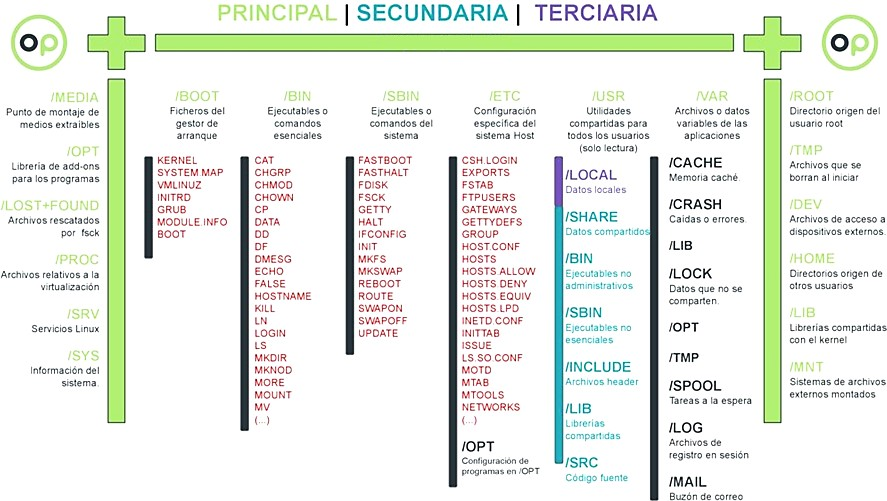
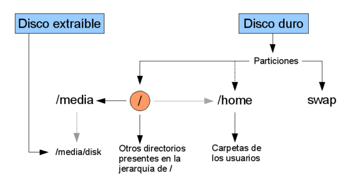

# UT9.3 - Estructura de sistemas Linux

## Sistemas de archivos Linux

💡 Linux soporta una gran variedad de **sistemas de ficheros**, desde sistemas basados en discos nativos como pueden ser **ext2, ext3, ext4, ReiserFS**, **swap**, XFS, JFS, UFS, F2FS, ISO9660 y compatibilidad con FAT, FAT32 y recientemente NTFS.

También sistemas de ficheros que sirven para comunicar equipos en la **red** de diferentes sistemas operativos, como **NFS** (utilizado para compartir recursos entre equipos Linux) y el **SMB** (entre máquinas Linux y Windows).

El sistema de archivos indica el modo en que se gestionan los archivos dentro de las particiones. Según su complejidad, tienen características como previsión de apagones, posibilidad de recuperar datos, indexación para búsquedas rápidas, reducción de la fragmentación para agilizar la lectura de los datos, etc.

La estructura del sistema operativo Linux en cuanto al almacenamiento de la información es más compleja que la utilizada por Windows, siendo jerárquica en árbol invertido.

En Linux no hay límite en la cantidad de archivos y directorios a crear dentro de un directorio. La siguiente figura muestra un ejemplo de una estructura típica de directorios en el sistema Linux:



```warning
Recuerda que a la hora de diferenciar un fichero de otro, Linux **distingue mayúsculas y minúsculas**, por lo que los ficheros "texto1.txt" y "Texto1.txt" son distintos.
```

La estructura interna del sistema de archivos de **Linux** es también distinta a la de Windows:

-   El **superbloque** en Linux contiene información del sistema de archivos como el tamaño de los bloques, tamaño máximo de archivos, espacio disponible y ocupado.
-   La **lista de inodos** almacena la información de cada archivo: identificador, tamaño, propietario, permisos, fecha creación/modificación.

## Estructura de directorios FHS

Las distribuciones Linux tienen todas un **árbol jerárquico o estructura de directorios** idéntico, muy similar a la estructura del sistema de archivos de plataformas UNIX.

Originariamente, en los inicios de Linux, este árbol de directorios tenía diferencias de una distribución a otra.

La falta de estandarización de los directorios de Linux fue solucionada por un grupo de trabajo compuesto por Rusty Russell, Daniel Quinlan y Christopher Yeoh, que entre otros creando el proyecto **FHS** *(Filesystem Hierarchy Standard)* en 1994-95 y usado en todas las distribuciones y sistemas Linux certificados actuales.



**FHS** establece que la **estructura de directorios de Linux** comienza a partir de un directorio raíz que se simboliza con la barra “**/**”.

De esta raíz ‘cuelgan’ el resto de los archivos y directorios del sistema. No hay nada por encima de la raíz y tampoco hay nada al lado de la raíz.



Cualquier persona o institución puede crear su propia **distribución** Linux y ponerla en el mercado.

**FHS** nos dice cómo tiene que ser la estructura de directorios y archivos para que una distro sea considerada Linux. Si nuestra distribución no cumple con lo expresado por el estándar, no será considerada Linux, si no “*basada”* en Linux.

**FHS** distingue entre varios **tipos de directorios**:

-   **Estáticos**: contienen binarios, bibliotecas, documentación, cuyo contenido <u>solo puede ser modificado y alterado por el administrador del sistema</u>. El resto de usuarios podrá sólo leerlos.
-   **Dinámicos**: son aquellos directorios cuyo contenido puede modificarse libremente. Algunos son importantes, puesto que contienen documentos de los usuarios o configuraciones de estos.
-   **Compartidos**: son archivos que pueden compartirse entre uno o varios usuarios del sistema Linux.



Una particularidad de Linux es que todo dentro del sistema es o se representa mediante **archivos**.

Tanto el software como el hardware. Desde el ratón, pasando por la impresora, el reproductor de DVD, el monitor, un directorio/subdirectorio y un fichero de texto.

Un Disco óptico o una unidad USB se **monta** como un subdirectorio en el sistema de archivos. En ese subdirectorio se ubicará el contenido del disco compacto cuando esté **montado** y, vacío cuando esté **desmontado**.



- / (**Directorio raíz**): Parecido a el directorio raíz “**C:\\**” de los sistemas operativos DOS y Windows. Es el nivel más alto dentro de la jerarquía de directorios.

- **/bin/** Los binarios son los **ejecutables** de Linux (similar a los archivos **.exe** de Windows). Contiene los comandos de consola como ls, cp, date, echo, mkdir, rmdir..

- **/boot/** Archivos necesarios para el **inicio** de Linux, desde los archivos de configuración del cargador de arranque (GRUB– LILO), hasta el propio **Kernel** del sistema.

- **/dev/** Este directorio contiene los **dispositivos hardware del sistema**, incluso los que no se les ha asignado (montado) un directorio, por ejemplo micrófonos, impresoras, pendrives (memorias USB)

- **/proc/** Enlaces a los **procesos** en ejecución del sistema e información de los trabajos internos de Linux.

- **/etc/** Aquí se guardan los principales **ficheros de configuración** del sistema, así como scripts del inicio del sistema.

- **/home/** Reúne los ficheros de **configuración de usuario** así como los archivos personales del mismo (documentos, música, videos, etc.), a excepción del superusuario (administrador, *root*) el cual cuenta con otro directorio aparte.

- **/lib/** Contiene las **bibliotecas** (librerías) esenciales de los programas alojados, para el núcleo, así como módulos y drivers.

- **/media/** Contiene los puntos de montaje de los **medios extraíbles** de almacenamiento. (CD-ROM , Pendrives o memorias USB), e incluso sirve para montar otras particiones del disco duro.

- **/mnt/** Se utiliza normalmente para montajes temporales de unidades. Es semejante a **/media**, pero usado por usuarios.

- **/sbin/** Sistema de binarios especial, comandos y programas exclusivos del superusuario (root).

- **/srv/** Aloja datos de servicios en red del sistema (servidores web, FTP, HTTP…)

- **/tmp/** Es un directorio donde se almacenan ficheros temporales. Cada vez que se inicia el sistema este directorio debería limpiarse.

- **/usr/** Contiene **archivos de programa compartidos** usados por todos los usuarios del sistema, pero que no obstante son de sólo lectura. Contiene **programas** no esenciales y utilidades usadas por los usuarios.

- **/root/** Directorio /home del administrador conocido como **root**. Es el único que no está incluido por defecto en el directorio **/home.**

- **/var/** Archivos que almacenan logs, correos electrónicos o bases de datos.




Esquema de **particionamiento** estándar recomendado y una **jerarquía** de ejemplo:

| **Partición** | **Tamaño** |
|---------------|------------|
| **swap**      | = RAM      |
| **/boot**     | 250 MB     |
| **/**         | 30 GB      |
| **/home**     | ∞          |



Cada vez que se añade un dispositivo de almacenamiento en Linux se crea un fichero en la carpeta */dev/sdx*, siendo x una letra correlativa. Además tal y como hemos visto por cada partición que haya en el disco se crea además otro fichero */dev/sdxn*, donde n es un número correlativo. 

Por ejemplo:

| **Unidad física o lógica**     | **Dispositivo Linux** | **Punto de montajes**   | **Equivalente Windows** |
|--------------------------------|-----------------------|-------------------------|-------------------------|
| Disco primario                 | /dev/sda              | /                       | C:                      |  
| Disco secundario               | /dev/sdb              | /mnt/secundario         | D:                      |
| Partición en el disco primario | /dev/sda1             | /mnt/particion          | E:                      |


Tanto las letras como los números se inicializan en cada arranque de forma que los nombres de los ficheros asociados a cada dispositivo pueden variar en cada momento. Para que una **partición** sea accesible esta debe **montarse** sobre un directorio.

Los dispositivos tipo pendrive se suelen montar automáticamente en: */media/usuario/ETIQUETA_VOL*

-   Aquellas particiones que vayan a contener información sensible deberían estar **cifradas** por cuestiones de seguridad. De esta manera, evitaremos que personas ajenas puedan acceder a la información contenida en esas particiones. Por regla general se debería considerar cifrar /home, como mínimo.
-   El directorio /var es utilizado por diferentes aplicaciones, entre la que hay que destacar *Apache y MariaDB*. Hay que tener en cuenta este detalle a la hora de dimensionar el sistema.
-   En el caso del directorio de temporales /tmp, se puede controlar realizando limpiezas programadas para evitar tener problemas con que estos directorios lleguen a ocupar demasiado espacio. Así, se pueden utilizar aplicaciones como tmpreaper que elimina aquellos archivos a los que no se ha tenido acceso durante un determinado periodo de tiempo.
