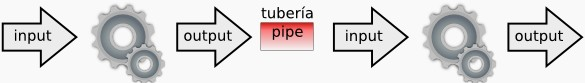
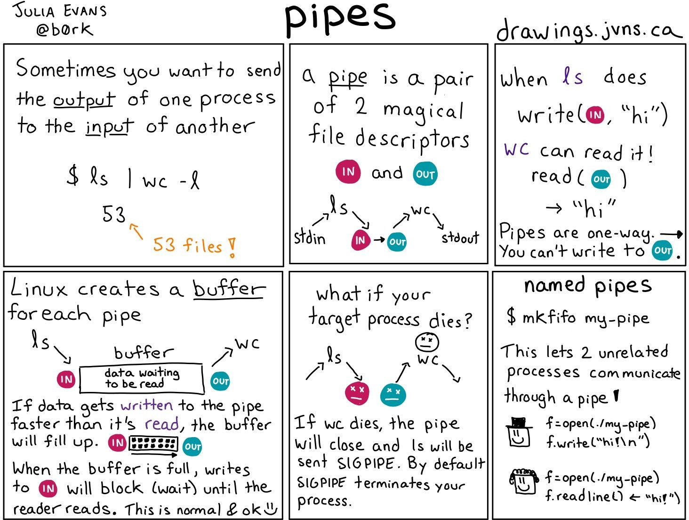
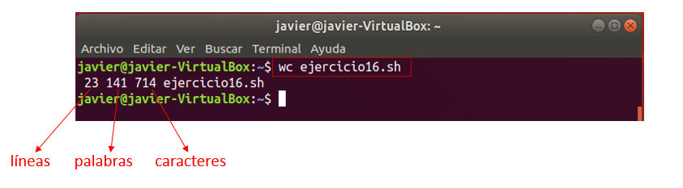
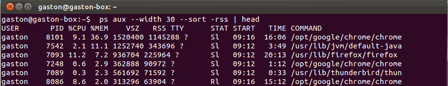
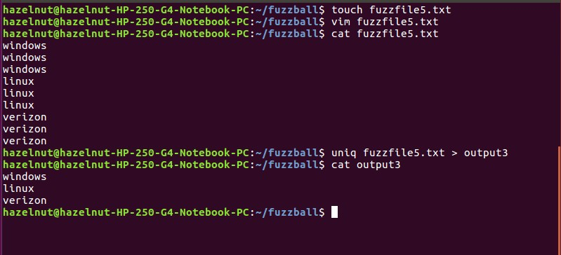
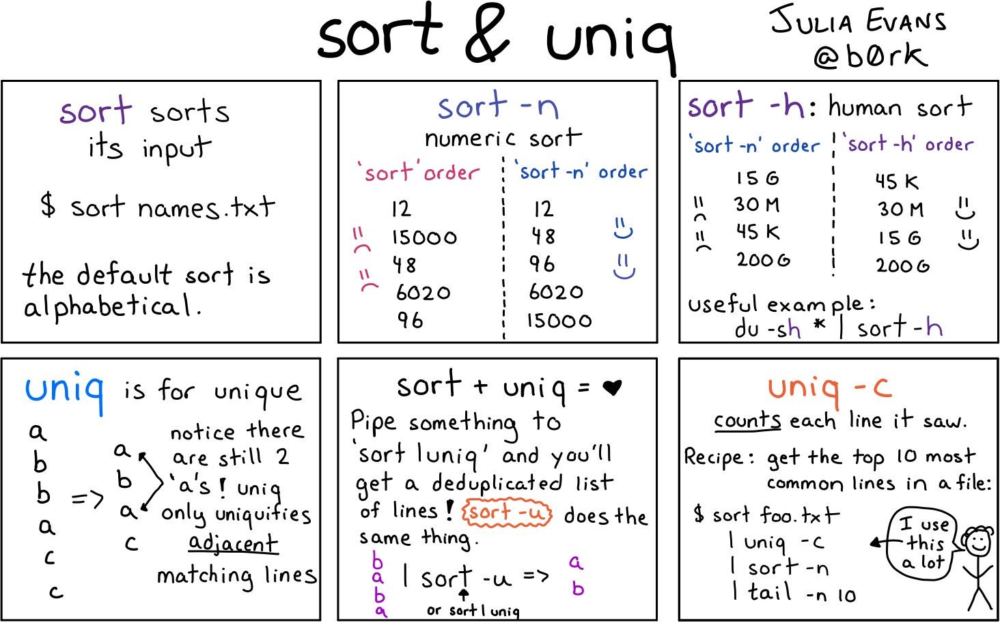
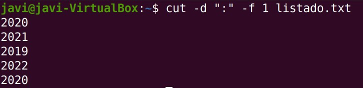
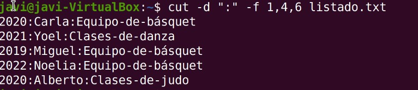

# UT11.2 Comandos de gestión de cadenas en Linux

## Tuberías y filtros

```tip
Desde la terminal de Linux posible introducir en una misma línea dos o más comandos separados por el carácter **tubería** o pipe ‘**\|**’ ,conectando la salida estándar de un comando con la entrada estándar de otro.
```



El uso más habitual es filtrar datos utilizando comandos que vamos a ir viendo, y que pueden actuar tanto como comandos como filtros.

    comando1 | comando2 | …

💡 La salida proporcionada por el comando1 se tomará como entrada para el comando2 y así sucesivamente



## Comando wc

```tip
El comando **wc** cuenta el número de **líneas, palabras y caracteres** de uno o más fichero(s), incluye espacios en blanco y caracteres de salto de línea.
```

Su sintaxis es la siguiente: 

    wc [parámetros] [fichero]

Donde sus parámetros pueden ser:

    -l visualiza el número de líneas del fichero.
    -w visualiza el número de palabras del fichero.
    -c visualiza el número de caracteres del fichero.




## Comandos head y tail

```tip
El comando **head** muestra las 10 **primeras líneas** de un fichero
```


Si queremos especificar las líneas a mostrar lo haremos con *head –n número*

```tip
El comando **tail** funciona de la misma forma, pero mostrando las 10 **últimas líneas** de un fichero.
```

## Comando grep

```tip
El comando **grep** permite **buscar** dentro de archivos, directorios o texto las líneas que concuerden con el elemento que especifiquemos (un patrón de búsqueda).
El comando grep localiza el patrón  <u>resaltándolo</u> en rojo.
```

La sintaxis básica del comando es la siguiente:

    grep [parámetros] [patrón_búsqueda] [fichero]

Donde parámetros puede ser:

    -c visualiza el nº total de líneas donde se localiza el patrón.
    -n Visualiza el nº de línea donde aparece el patrón y línea completa
    -i Elimina la diferencia entre mayúsculas y minúsculas.
    -l Visualiza el nombre de los ficheros donde se localiza el patrón.
    -v Visualiza las líneas del fichero donde no aparece el patrón.
    -w obliga a que patrón coincida solamente con palabras completas.
    -E Sirve para indicar que queremos definir una expresión regular de búsqueda.

Algunos ejemplos usando el comando **grep**:

```bash
# Buscar la cadena Texto en el fichero texto.txt
grep "Texto" texto.txt
# Visualizar el contenido de texto.txt y buscar la cadena hola
cat texto.txt | grep "hola"
# Cuenta las veces que aparece la cadena "hola" en el fichero log.txt
grep -c "hola" log.txt
# Verificar si un usuario existe en el sistema
grep nombre_usuario /etc/passwd
# Visualizar los archivos con permisos 777 (rwxrwxrwx)
ls –l | grep rwxrwxrwx
```

## Expresiones regulares en grep

Se puede usar el comando grep con el parámetro **-E** para buscar con un patrón usando lo que se conoce como **expresiones regulares básicas**. Las expresiones regulares están formadas por letras y números, así como por caracteres.

Las <u>expresiones regulares</u> incluyen:

| **Símbolo** | **Descripción**                                                     |
|-------------|---------------------------------------------------------------------|
| .\*         | Para representar cero o más caracteres.                             |
| . (punto)   | Para representar un solo carácter.                                  |
| [a e i o u] | Para representar algunos caracteres.                                |
| [A-Z][0-9]  | Para presentar un rango de caracteres.                              |
| **\^**      | Para representar el inicio de una línea de texto.                   |
| **\$**      | Para representar el fin de línea de texto.                          |
| **+**       | Que el carácter o conjunto previo aparezca al menos una vez.        |
| **{n,m}**   | Que el carácter o conjunto previo aparezca entre n y m veces.       |

Ejemplos de **expresiones regulares básicas** que podemos usar con *grep*: 

- Un signo de intercalación (\^) indica el <u>inicio de línea</u>:

    ```bash
        grep '^b' texto.txt 
    ```

- Un signo de dólar (\$) indica el <u>fin de línea</u>:

    ```bash
        grep 'a$' texto.txt
    ```

- Para representar un carácter se utiliza el **.** y para múltiples carácteres el .\*

    ```bash
        grep –E 'f.cher.' grep 'tex.*' 
    ```

- Para los rangos y caracteres individuales se utilizan los corchetes:

    ```bash
        grep '[A-Z][aeiou]'
    ```

- Que un caracter aparezca entre n y m veces:

    ```bash
        grep -E 'a{3,5}' texto.txt 
    ```

- El carácter 'e' aparece una o ninguna vez:

    ```bash
        grep -E 'e+' texto.txt 
    ```


## Comandos sort y uniq

```tip
El comando **sort** se utiliza para ordenar líneas de un fichero o un flujo, puede usarse como comando o como filtro.
```

Puede ordenar alfabética o numéricamente, teniendo en cuenta que cada línea del fichero es un registro compuesto por varios campos, los cuales están separados por un carácter denominado separador de campo (tabulador, espacio en blanco…)

Su sintaxis es: 

    sort [parámetros] [fichero]



Donde parámetros puede ser:

    -n Para ordenación numérica
    -k Indicando un nº por qué columna ordenar
    -t Para indicar el separador de columnas
    -r Indica ordenación inversa
    

💡 Otro comando muy útil es **uniq.** Se usa en combinación con **sort** para eliminar las líneas que están repetidas, dejando la salida con líneas que no están repetidas. Para que funcione correctamente las líneas o ficheros deben estar ordenados, ya que trabaja con líneas adyacentes.





## Comando tr

```tip
El comando **tr** permite sustituir unos **caracteres** por otros dentro de un archivo. Primero especificamos lo que vamos a sustituir y seguidamente lo que lo sustituye.
```

Su sintaxis es:

    tr [parámetros] caracteres1 [caracteres2]

Donde parámetros puede ser:

    -d: elimina los caracteres indicados en caracteres1 .
    -s: reemplaza los caracteres repetidos duplicados.
    -c: los caracteres que no estén indicados en *caracteres1* los convierte a *caracteres2*.

Algunos ejemplos útiles con **tr**:

```bash
# Eliminar los caracteres emp de la palabra ejemplo
echo ejemplo | tr –d emp
# Cambiar las minúsculas por mayúsculas
echo 'Hola Mundo' | tr '[a-z]' '[A-Z]' 
# Suprimir espacios en blanco
echo "Hola que tal?" | tr –d ' ' 
# Suprimir espacios en blanco duplicados
echo "     espacio sobra      " | tr –s ' '
```

## Comando cut

```tip
El comando **cut** es utilizado para la extracción de <u>segmentos</u> (o columnas) de las líneas de texto. 
```

Dada una línea de texto la trocea según el <u>separador o delimitador</u> que le indiquemos.

Su sintaxis es:

    cut [parámetros] [fichero]

Donde parámetros puede ser:

    -d carácter separador o delimitador
    -f rango o columna a extraer
    -c carácter a partir del cual cortar

Por ejemplo:

    ```bash
    # Coge las letras de las posiciones 2 a la 4 inclusive (esi)
    echo "mesilla" | cut -c 2-4
    # Cortar la cadena por la letra 'i' devolviendo la segunda parte (lla) 
    echo "mesilla" | cut -di -f2
    ```

Vamos a ver más ejemplos típicos del uso de **cut.** Dado un fichero de texto separado por espacios llamado *listado.txt* con el siguiente contenido:

    2020:Junio:23:Carla:Martínez:Equipo-de-básquet
    2021:Abril:22:Yoel:Alonso:Clases-de-danza
    2019:Febrero:21:Miguel:Molina:Equipo-de-básquet
    2022:Enero:22:Noelia:Bernabeu:Equipo-de-básquet
    2020:Mayo:11:Alberto:Silvestre:Clases-de-judo


Mostrar la primera columna:



Mostrar la primera, cuarta y sexta columna:



## Comando sed

El comando sed se utiliza generalmente para sustituir cadenas por otras, pero también para añadir o borrar líneas particulares (aunque se pueden usar otros comandos). 
La sintaxis básica para sustituciones de cadenas de textos, que es para lo que más se utiliza este comando, es la siguiente:

    sed "s/<antiguo_texto>/<nuevo_texto>/g"

La **g** final permite realizar una sustitución en toda la línea en caso de haya varias coincidencias. Si se utiliza en su lugar un número N realizará la sustitución de la n-aparición del patrón en la línea y si se indica al principio, el nº de línea.

Si quisiéramos modificar el fichero original con nuestros cambios, deberemos de utilizar el parámetro –i.

```bash
# Sustituir todas las apariciones de la palabra Windows por Linux del fichero:
sed 's/Windows/Linux/g' fichero.txt
```

El comando sed permite direccionar en qué líneas o rango de la entrada se aplica dicho comando. Se puede hacer mediante un número especificando el número de línea de la entrada, o especificando una expresión regular entre caracteres /

```bash
# Actuar sobre la línea 3 sustituyendo dichas palabras
sed '3 s/Windows/Linux' fichero.txt
# Eliminar las líneas 2 a 7 del fichero
sed '2,7 d' fichero > fichero2
```

También se puede mostrar una línea/s completa/s usando sed –n nº p

```bash
sed –n 3p
# Para varias líneas
sed –n '3p;5p'
```


## Comando awk

```tip
El comando **awk** es una herramienta avanzada de procesamiento de patrones en líneas de texto. 
```

Su utilización estándar es la de filtrar ficheros o salida de comandos de Linux, tratando las líneas para, por ejemplo, mostrar unas determinadas columnas de información.

La sintaxis básica de *awk* es:

    awk [condicion] { comandos }

*awk* es un comando que puede ser útil para mostrar columnas concretas de forma más sencilla que **cut**:

```bash
# Mostrar sólo los nombres y los tamaños de los ficheros:
ls -l | awk '{ print $8 ":" $5 }'

# Mostrar las columnas 1,3 y 6 de un fichero de texto
awk '$1, $3, $6' listado.txt
```

Cuando las columnas no están separadas por espacios, si no por otro tipo de separador como el ; o los : hay que utilizar el parámetro **–F** indicando dicho separador.

```bash
# Mostrar las columnas 1 y 5 del fichero de contraseñas passwd que tiene como separador de columnas los :
awk –F ":" '$1, $5' /etc/passwd
```

> awk es un comando avanzado que permite hacer muchas más cosas y que se verá en posteriores cursos.


---


Listado de comandos de **gestión de cadenas** destacados:

| **Comando** | **Acción**                                             | **Ejemplo**                 |
|-------------|--------------------------------------------------------|-----------------------------|
| **wc**      | contar el nº de líneas, caracteres y de palabras.      | wc –l fichero.txt           |
| **head**    | Visualiza las primeras filas de un fichero             | head -n5 /var/log/dmesg     |
| **tail**    | Visualiza las últimas filas de un fichero              | tail /var/log/dmesg         |
| **grep**    | buscar un patrón en un fichero.                        | grep javier /etc/passwd     |
| **sort**    | ordenar el contenido de un fichero/listado.            | ls –l \| sort               |
| **uniq**    | elimina filas duplicadas.                              | cat fichero \| uniq         |
| **tr**      | sustituir grupos de caracteres por otros indicados.    | tr 'abc' '123'              |
| **cut**     | cortar o extraer elementos de una línea de un fichero. | cut –d “:” -f 2             |
| **awk**     | herramienta de filtrado avanzado de texto              | ls -l \| awk '{print \$8"}' |
